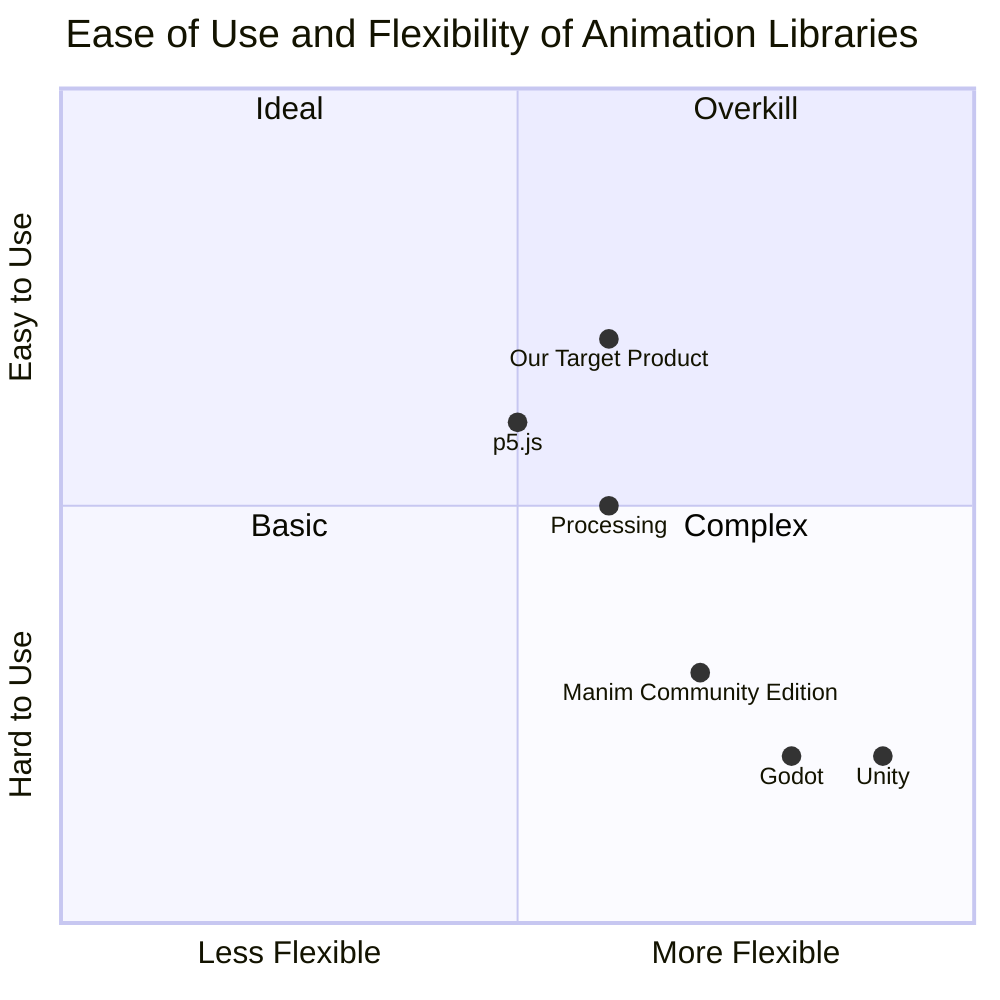

## Original Requirements
The boss has requested for a simulation of a computer with an interrupt table using Manim. The code should be contained in a single class.

## Product Goals
```python
[
    "Create a Manim simulation of a computer with an interrupt table",
    "Ensure the code is contained within a single class",
    "Ensure the simulation is visually clear and easy to understand"
]
```

## User Stories
```python
[
    "As a computer science student, I want to visualize how a computer with an interrupt table works so I can better understand the concept",
    "As a teacher, I want to use this simulation in my class to help my students understand the concept of interrupt tables in computers",
    "As a developer, I want to be able to easily modify the code for the simulation to suit my specific needs"
]
```

## Competitive Analysis
```python
[
    "Manim Community Edition: An open-source animation engine for explanatory math videos. It's powerful but complex to use",
    "Processing: A flexible software sketchbook and a language for learning how to code within the context of the visual arts. It's more art-oriented",
    "Unity: A cross-platform game engine. It's overkill for this kind of simulation and has a steep learning curve",
    "Godot: A 2D and 3D, cross-platform, free and open-source game engine. It's also overkill for this kind of simulation and not as widely used as Unity",
    "p5.js: A JavaScript library that starts with the original goal of Processing, to make coding accessible for artists, designers, educators, and beginners, and reinterprets this for today's web"
]
```

## Competitive Quadrant Chart


## Requirement Analysis
The product should be a simulation of a computer with an interrupt table, created using Manim. The code for this simulation should be contained within a single class. The simulation should be visually clear and easy to understand.

## Requirement Pool
```python
[
    ("Create a Manim simulation of a computer with an interrupt table", "P0"),
    ("Ensure the code is contained within a single class", "P0"),
    ("Ensure the simulation is visually clear and easy to understand", "P0"),
    ("Provide documentation for the code", "P1"),
    ("Ensure the code is easily modifiable", "P1")
]
```

## UI Design draft
As this is a simulation, the UI will primarily be the animation itself. It should clearly show a computer and an interrupt table. The computer should visually respond to interrupts, and the interrupt table should update accordingly. The design should be simple and clean, with a focus on clarity and understanding.

## Anything UNCLEAR
There are no unclear points.