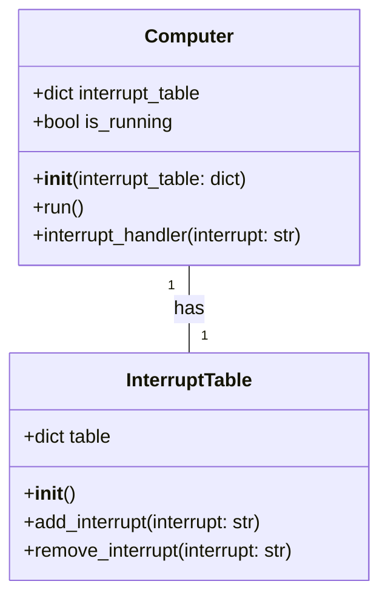
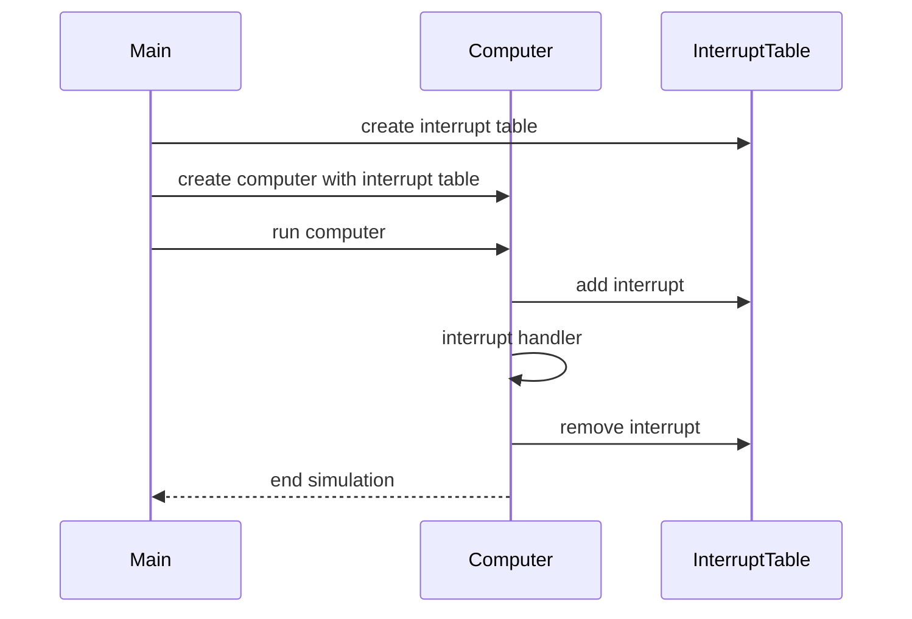

## Implementation approach
We will use Manim Community Edition, an open-source animation engine, to create the simulation. The difficult point is to create a visually clear and easy-to-understand simulation of a computer with an interrupt table. We will need to design the animation in a way that clearly shows the interrupt table and how the computer responds to interrupts. We will also need to ensure that the code for the simulation is contained within a single class, which will require careful planning and organization of the code.

## Python package name
```python
"interrupt_simulation"
```

## File list
```python
[
    "main.py",
    "computer.py",
    "interrupt_table.py"
]
```

## Data structures and interface definitions


## Program call flow


## Anything UNCLEAR
The requirement is clear to me.