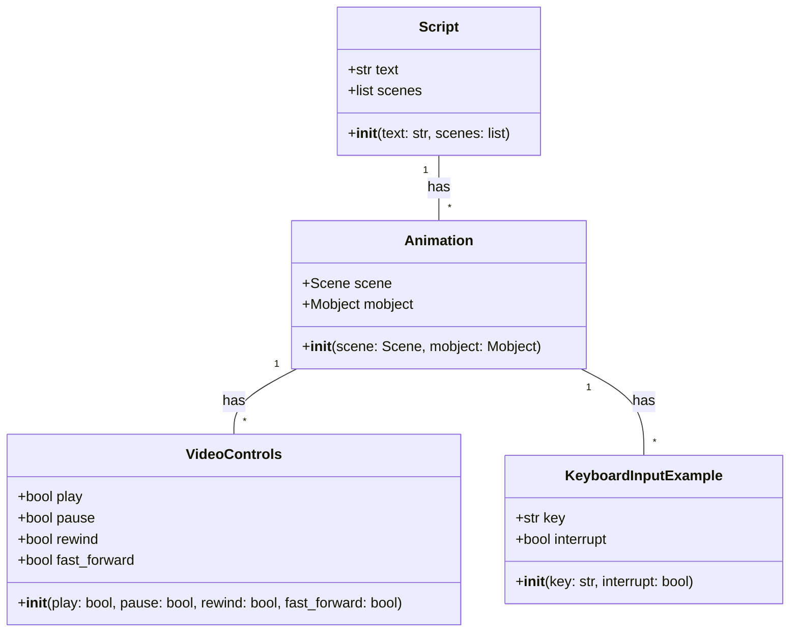
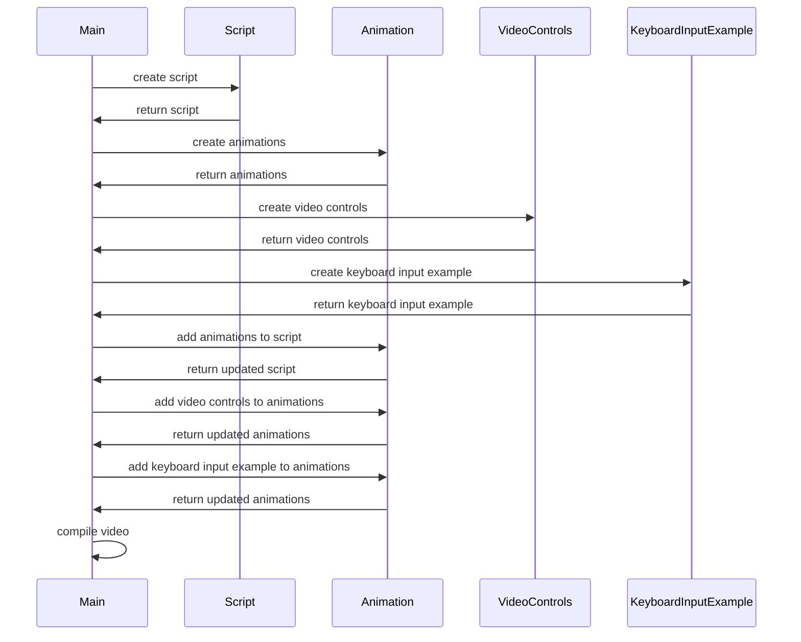

## Implementation approach
The system will be implemented in Python, using Manim for creating animations. The video player functionality can be achieved using MoviePy, another open-source Python library. The script for the video will be written in Python, and the animations will be designed using Manim's scene and mobject classes. The keyboard input example will be incorporated into the animations, showing how an interrupt is triggered when a key is pressed and how the operating system handles this interrupt. The video controls (pause, rewind, fast-forward) will be implemented using MoviePy's preview functionality. The video will be tested on multiple platforms to ensure compatibility and accessibility.

## Python package name
```python
"os_interrupts_video"
```

## File list
```python
[
    "main.py",
    "script.py",
    "animation.py",
    "video_controls.py",
    "keyboard_input_example.py",
    "test.py"
]
```

## Data structures and interface definitions


## Program call flow


## Anything UNCLEAR
The requirement is clear to me.